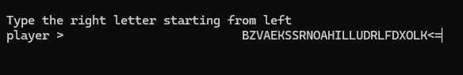

# Perry-typer
Practice typing on keyboard without looking 



## Requisites & dependencies

 A C compiler is required to compile and run the program (`gcc` o `clang`), `make` and **ncurses** development headers.

### Dependencies installation

- **Debian / Ubuntu / Linux Mint:**
  ```bash
  sudo apt update
  sudo apt install build-essential libncurses-dev
  ```

- **Arch Linux / Manjaro:**
  ```bash
  sudo pacman -S base-devel ncurses
  ```
- **Fedora / RHEL:**
  ```bash
  sudo dnf install gcc make ncurses-devel
  ```

- **macOS (via Homebrew):**
  ```Bash
  brew install ncurses
  ```

## Compilation and execution

1. Clone the repository:
```Bash
  git clone https://github.com/4ndr34p3rry/Perry-typer
```
2. Compile the project:
```Bash
  make
```
3. Run the program:
> Make sure your terminal window is wide enough or it will go crazy, see customization
```Bash
  ./perryTyper
```
4. Clean generated binary files:
```Bash
  make clean
```

## Customization
  ### Amount of letters
 It is possible to set a different amount of letters in two ways:
- **Editing `game.h` header file:**
> Use any text editor you prefer to open the file 

  Edit the parameter GAME_WIDTH as you wish, it will set a maximum width the game will occupy and will scale the game size accordingly.

```C
    #define GAME_WIDTH 120 //<== edit this

    #define CURSOR "player >"

    void spawnLetter(char*, int*);

    void killLetter(char*, int*);

    void spawnPhrase(char*, char*, int*);

    void fixPhrase(char*, int);
```


- **Using arguments:**
  ```Bash
  ./perryTyper 25
  ```
  This will spawn a game 25 letters long but its value cannot be equal or greater than GAME_WIDTH

###  Change player/cursor

It is possible to change the "player" by editing `game.h` header file

```C
  #define GAME_WIDTH 120 

  #define CURSOR "player >" //<== edit this inside quotes

  void spawnLetter(char*, int*);

  void killLetter(char*, int*);

  void spawnPhrase(char*, char*, int*);

  void fixPhrase(char*, int);
```
